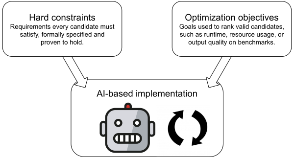

In this post, I'd like to collect some thoughts on what I believe is a new paradigm in software engineering. It is feasible today, and my colleagues and I have used it successfully over the past two weeks. In short, the paradigm combines **formal verification and AI**:

- Humans specify what they want the software to do in a formal language such as [Lean](https://lean-lang.org/).
- AI writes the software *and* a formal proof that it adheres to the specification. The proof is machine-checkable, eliminating the need for human review of the generated implementation for the properties covered by the specification.

## AI by itself suffers from the review bottleneck

I believe that this combination of formal verification and AI is *much* more effective than AI by itself. The reason is code review. Even if agents can write code at near-zero marginal cost, reviewing all that code becomes the new bottleneck.

So why not YOLO it and drop review altogether? In some domains, that might be fine. But for most codebases, AI would have to get *a lot* better first. The way I think about it, AI may now be roughly on par with a single human at writing code. A single developer can maintain quality, but cannot scale; human teams scale by distributing the work and using code review to keep quality high. AI scales the writing without scaling the reviewing, creating a bottleneck.

Note that I am not talking about airplanes here. Lots of "ordinary" software isn't critical enough to need formal verification for its own sake, but it *is* critical enough that you don't want to YOLO it either. The key point of this post is: **formal verification is a means to use AI more effectively**. The increase in assurance is almost a side effect.

## Eliminating the review bottleneck

The formal verification + AI approach can eliminate human review of generated implementation code in two ways. First, assuming the specification captures the intended behavior, you don't have to worry about correctness of the code. Second, if the code is entirely managed by AI, its maintainability and human readability become less important.

The general framework is as follows:




- **Humans define the *hard constraints***: These are the required properties of the software, expressed as a formal specification. Usually, they capture some notion of correctness.
- **Humans define the *optimization objectives***: Benchmarks measure what the code should optimize for. Obvious examples include runtime and resource usage, but the objectives can also include hard-to-formalize properties that can be tested experimentally.
- **Agents write the code and proofs**: Every proposed change comes with a formal proof that the software satisfies the hard constraints. Benchmarks also run automatically for each change and measure the optimization objectives.

One special case of this framework is [Andrej Karpathy's autoresearch project](https://github.com/karpathy/autoresearch), which searches for better machine learning algorithms. Its primary acceptance signal is a soft goal: model performance on a validation set. Useful model quality is difficult to specify exhaustively as a hard constraint, so empirical measurement is the natural driver in that setting.

The point of this framework is that little human effort is needed to evaluate each generated implementation change. Hard constraints are proven to be met by the agent. Optimization objectives are measured automatically. If there are several objectives, a human may still need to choose among tradeoffs—what if quality improves, but runtime also increases?—although even that could potentially be automated.

<details class="blog-aside">
<summary>Aside: Analogies to machine learning</summary>

Before I worked in applied cryptography, I was a machine learning engineer building tools to [segment 3D image data](https://scalableminds.com/voxelytics). The analogies between this approach and machine learning are striking:

- Because the agents can see the benchmarks and repeatedly optimize against them, the benchmarks are essentially the *training set*. Each one can be *labeled*, i.e., come with a desired output, or *unlabeled*.
- *Overfitting* is a risk of this approach. We want the resulting algorithm to also perform well on inputs outside the training set.
- One way to mitigate overfitting is to give instructions like "try to write general passes" or "don't add a new pass, generalize an existing one". It's a form of *regularization*.
- Asking agents to optimize a metric resembles *reinforcement learning*. For example, our circuit optimizer performed poorly on one metric simply because I hadn't told the agents to optimize it. A poor *reward* design!
- More generally, *specification gaming* is a serious issue. We did catch an agent [exploit a weakness in the spec](https://github.com/powdr-labs/apc-optimizer/pull/147#issuecomment-5003090287).
- And, of course, *we no longer understand the implementation*. We measure how well the software works in practice, but we also get a proof that it satisfies the formal specification. That is stronger than the usual machine-learning setting.

</details>

## A Hello World example

Suppose we wanted to implement a function that returns the k-th smallest element of a list of integers. We'll start with Lean definitions that capture what it means for this function to be correct:

```lean
/-- `x` is the k-th smallest element of `l` (0-indexed). -/
def IsKthSmallest (k : Nat) (l : List Int) (x : Int) : Prop :=
  x ∈ l ∧ (l.filter (· < x)).length ≤ k ∧ k < (l.filter (· ≤ x)).length

/-- An implementation is correct if it returns the k-th smallest element,
    for all valid `k` and `l`. -/
def IsCorrect (impl : Nat → List Int → Int) : Prop :=
  ∀ (k : Nat) (l : List Int), k < l.length → IsKthSmallest k l (impl k l)
```

Then we bootstrap the implementation section. Lean's `sorry` keyword is a placeholder for a proof or implementation that we haven't written yet. It will panic when executed and generate a compiler warning. This is the section that the AI agents will fill in.

```lean
def selectKthSmallest (k : Nat) (l : List Int) : Int := sorry
theorem selectKthSmallest_correct_impl : IsCorrect selectKthSmallest := sorry
```

In theory, the agent could simply weaken the statement of `selectKthSmallest_correct_impl`. To prevent that, we add another theorem in a section that agents are not allowed to change, with the proof delegating to the former:

```lean
theorem selectKthSmallest_correct : IsCorrect selectKthSmallest :=
  selectKthSmallest_correct_impl
```

Finally, we'll add a synthetic benchmark to measure the runtime of the implementation. This is an optimization objective, and the agent will be asked to optimize it.

```lean
def randomInts (seed : Nat) (count : Nat) : List Int :=
  (List.range count).map (fun i => Int.ofNat ((i * 2654435761 + seed) % 100000))

def bench (k : Nat) (input : List Int) : IO Unit := do
  let t0 ← IO.monoNanosNow
  let c ← IO.lazyPure (fun _ => selectKthSmallest k input)
  let t1 ← IO.monoNanosNow
  IO.println s!"  k={k}: {Float.ofNat (t1 - t0) / 1e6} ms  (result {c})"

def main : IO Unit := do
  for n in [1000, 10000, 100000] do
    let input := randomInts 42 n
    IO.println s!"n={n}"
    for k in [1, 5, n / 10, n / 2, n - 1] do
      bench k input
```

The full demo is available [here](https://gist.github.com/georgwiese/d5bd12da7c4f130b97b10bc568370fab). You can point your favorite agent at it and ask it to replace the `sorry` sections so that the program compiles without warnings and runs as fast as possible on the benchmarks.

I tried this. At first, the agent chose the simplest implementation: sorting the full list and selecting the k-th element. It then improved the implementation by switching to [quickselect](https://en.wikipedia.org/wiki/Quickselect). The final implementation and proof are around 150 lines long.

## Case study: powdr autoprecompiles

For the past two years, my work at [powdr](https://powdr.org/) has largely focused on [autoprecompiles](https://powdr.org/blog/accelerating-ethereum-with-autoprecompiles) for zkVMs. If you don't know what any of that means, it doesn't matter for this post. In essence, the core component of the system is a function like this:

```rust
fn optimize(input_circuit: Circuit) -> Circuit
```

`Circuit` has a notion of *equivalence*. The `optimize` function is correct if the output circuit is equivalent to the input circuit. For example, the identity function would be a correct optimizer. A circuit also has a measurable size. A *good* optimizer reduces that size significantly.

This maps cleanly to the framework above: optimizer correctness is a hard constraint; circuit-size reduction and optimizer runtime are optimization objectives. The [`apc-optimizer`](https://github.com/powdr-labs/apc-optimizer/tree/main) repository implements this framework and is set up as follows:

- Around 500 lines of Lean specify exactly what it means for an optimizer to be correct. The core is [`Spec.lean`](https://github.com/powdr-labs/apc-optimizer/blob/main/ApcOptimizer/Spec.lean), if you want to get a feel for it. Writing the specification took around two days, plus a day of review by team members.
- We check in a few relevant benchmarks. Those are real-world input circuits for which we care about optimizer performance. A benchmarking script measures both the quality of the optimizer and the runtime.
- When a PR is opened, CI (1) applies a label if only a whitelisted set of files was touched (which excludes all of the specification and benchmarks), and (2) runs the benchmarks and posts the result into a comment.

In practice, "reviewing" a generated implementation PR consists of checking for the label and skimming a comment like [this](https://github.com/powdr-labs/apc-optimizer/pull/120#issuecomment-4965408068). AI agents have written 100% of the optimizer implementation and its proofs with minimal guidance. We do not review the generated code at all. In fact, I barely know Lean.

**Results**: Circuit-size reduction is on par with our previous implementation; see [this comparison](https://github.com/powdr-labs/bench-results/tree/gh-pages/results/2026-07-20-0557-lean) across a suite of benchmarks. The agents were asked to optimize only a subset of these benchmarks, so the results on the others are evidence that the optimizer generalizes. Runtime is still slower than that of our Rust implementation, but it has not been a priority so far, and we are confident that it can be improved. Our slowest test case became more than three times faster in the last three days.

**Integration**: We have integrated this code into our main codebase as an alternative to our existing Rust implementation. Lean can be compiled to C, which is then invoked from Rust via FFI.

For more information about this specific use case, see our [blog post on formally verified autoprecompiles](https://powdr.org/blog/formally-verified-autoprecompiles).

## What this means for software engineering

On a personal note, it has felt overwhelming to rebuild a core component of our main product in just a week or two. I think many software engineers feel both overwhelmed by what AI can do today and underwhelmed by how much faster it lets them ship. I believe the review bottleneck described above explains much of that gap. Formal verification *can* close it.

The key question, of course, is how widely this approach applies. That remains largely an open question, and I hope this post sparks discussion. Here are a few thoughts:

- For the approach to deliver a meaningful speedup, writing and auditing the specification must be substantially cheaper than writing and maintaining the implementation.
- Reusable libraries of concepts would help. For example, most web backends have some notion of user accounts, access rights, and databases. Just as we now reuse software libraries, we could reuse specification libraries.
- Thanks to FFI, we can introduce AI-generated, formally verified code one module at a time without rewriting the entire codebase. Even if the approach applies only to certain components, it can still be valuable there. In our case, we used it only for the optimizer.

Ultimately, software development might no longer be about code, but about requirements. Critical properties would be specified formally; everything else could be expressed through prompts and validated through automated and manual testing. We might never see the generated code—or even know the programming language it was written in.

*For various discussions around this subject, I'd like to thank Leandro Pacheco, Leo Alt, Jonathan Striebel and Arne Binder.*
